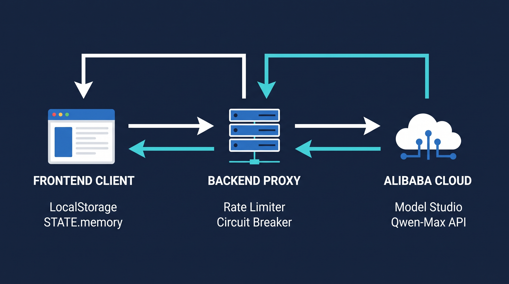

#  AIMRoyale — Qwen Cloud Hackathon (Track 1)

## 🎯 Overview
**AIMRoyale** is an AI-powered mathematical arena that generates highly personalized, real-time math challenges based on the user's school grade and difficulty level. Powered by Alibaba Cloud's Qwen-Max model, it features a native, zero-database **MemoryAgent** that tracks the user's progress cross-session.

---

## 🧠 Track 1: MemoryAgent Features
This project strictly implements the core architectural rules of the MemoryAgent track:

*   **Cross-Session Memory:** Integrates `localStorage` with our adaptive AI prompt builder to seamlessly retain user preferences, lore choices, and historical error rates without database overhead.
*   **Smart Decay (Pedagogical Timely Forgetting):** Implements an automated forgetting mechanism. If a user successfully answers 3 consecutive questions on a specific mathematical topic, the agent declares the concept "mastered" and purges past errors from its active context window to avoid anchoring.
*   **Context Window Management (FIFO):** Enforces a strict cap of the 5 most recent mistakes (`recentMistakes`). Older errors are evicted using a First-In, First-Out strategy to optimize token consumption and prevent LLM prompt saturation.

---

## 🛠️ System Architecture

*   **Frontend:** Vanilla JS (`app.js`, `index.html`) using a sleek, low-latency *Fermat Chroma Design System*.
*   **Backend Proxy:** Node.js + Express (`server.js`) acting as a secure gateway to authenticate requests, manage rate limits, and isolate credentials.
*   **AI Infrastructure:** Connected natively to the **Alibaba Cloud Model Studio (DashScope API)** utilizing the advanced `qwen-max` model.

---

## ☁️ Proof of Alibaba Cloud Deployment
Our core architecture relies natively on Alibaba Cloud infrastructure. You can verify our active production integration directly in the [`server.js`](server.js) file, which handles asynchronous routing to `dashscope.aliyuncs.com` using the required `qwen-max` production model.

---

## 📄 License
This project is open-source and licensed under the terms of the [MIT License](LICENSE).
